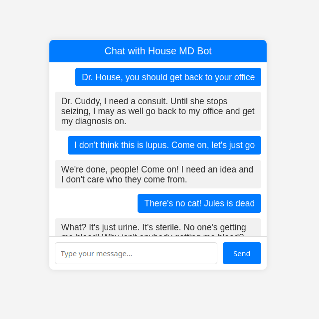
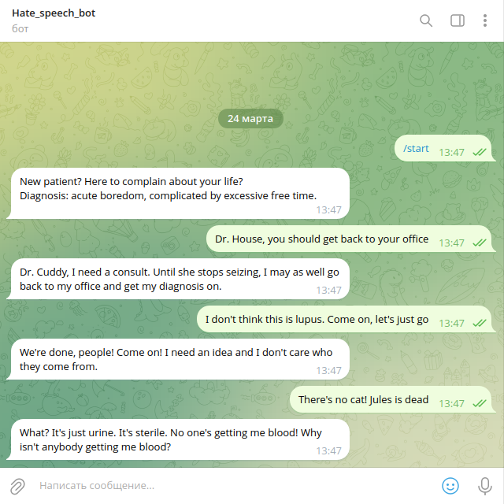
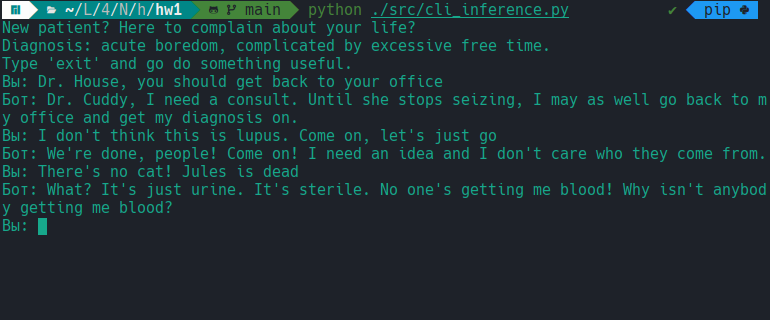
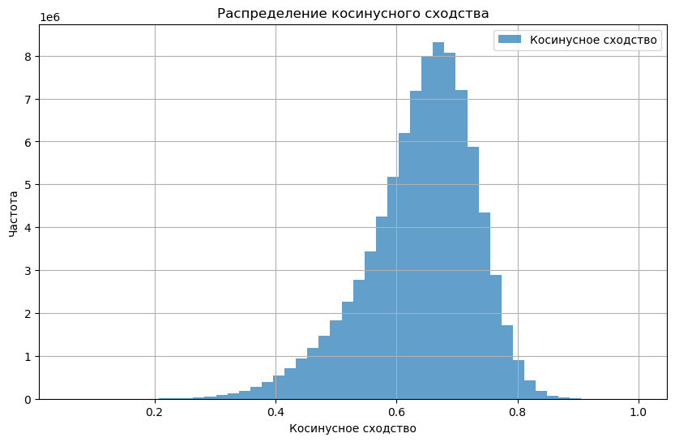

# Отчет о выполнении задания

## Описание проекта

Этот проект представляет собой retrieval-based чат-бота, который имитирует стиль и манеру речи доктора Хауса из сериала "Доктор Хаус". Бот использует BERT для получения эмбеддингов текста и косинусное сходство для поиска наиболее подходящих ответов. Проект включает:

- Веб-интерфейс на FastAPI. [http://kosatchev.ru:8000/ (NO SSL)](http://kosatchev.ru:8000/)
- Telegram-бот. [@hate_speech_bot](https://t.me/Hate_speech_bot)
- Бот в виде командной строки.
- Docker-контейнеры для развертывания на сервере.


## Данные

- **Источник**: Транскрипции сериала "Доктор Хаус" с Kaggle.
- **Объем**: 8 сезонов, ~10 000 реплик.
- **Предобработка**:
  - Очистка текста от лишних символов и тегов.
  - Создание пар "контекст-ответ".


## Модель

**Архитектура**: BERT для получения эмбеддингов, косинусное сходство для поиска ответов.


## Веб-приложение



**Технологии**: FastAPI, HTML, JavaScript.

### Функционал

  - Отправка сообщений по нажатию **Enter** или кнопки **Send**.
  - Отображение истории сообщений.
  
### Запуск

```bash
python src/web_app.py
```


## Telegram-бот



**Технологии**: python-telegram-bot.

### Функционал

- Ответы на сообщения пользователя.
- Поддержка команды /start.

### Запуск

```bash
python src/telegram_bot.py
```


## Инференс командной строки



### Функционал

- Общение с моделью через терминал.
- Поддержка команды exit для завершения.

Запуск:
```bash
python src/cli_inference.py
```

## Docker

### Контейнеры:

- house-md-telegram-bot: Telegram-бот.
- house-md-web-app: Веб-приложение.

**Управление**: Docker Compose.

### Запуск

```bash
docker-compose up --build
```


## Зависимости

Зависимости разделены для разных частей проекта:

- Telegram-бот: requirements_bot.txt
- Веб-приложение: requirements_web.txt
- Обучение и обработка модели: requirements_train.txt

Для установки зависимостей локально:

```bash
# Для Telegram-бота
pip install -r requirements_bot.txt

# Для веб-приложения
pip install -r requirements_web.txt

# Для обучения и обработки модели
pip install -r requirements_train.txt
```

## Графики
В результате тестирования, получилось такое распределение



## Выводы
- Бот успешно имитирует стиль доктора Хауса.
- Веб-приложение и Telegram-бот работают стабильно.
- Docker-контейнеры позволяют развернуть приложения на любом сервере.


## Автор

Косачев Дмитрий Викторович


### **Итоговая структура проекта**
```
house-md-chatbot/
├── data/
│ ├── raw/
│ │ ├── context_answer.csv
│ └── processed/
│ │ ├── season1.csv
│ │ ├── ...
│ │ ├── season8.csv
├── models/
│ └── response_embeddings.npy
├── src/
│ ├── web_app.py
│ ├── telegram_bot.py
│ ├── preprocess.py
│ ├── train.py
│ ├── validate.py
│ └── cli_inference.py
├── images/
│ └── similarities.png
├── templates/
│ └── index.html
├── Dockerfile.bot
├── Dockerfile.web
├── docker-compose.yml
├── requirements_bot.txt
├── requirements_web.txt
├── requirements_train.txt
├── README.md
├── .gitignore
└── .env
```